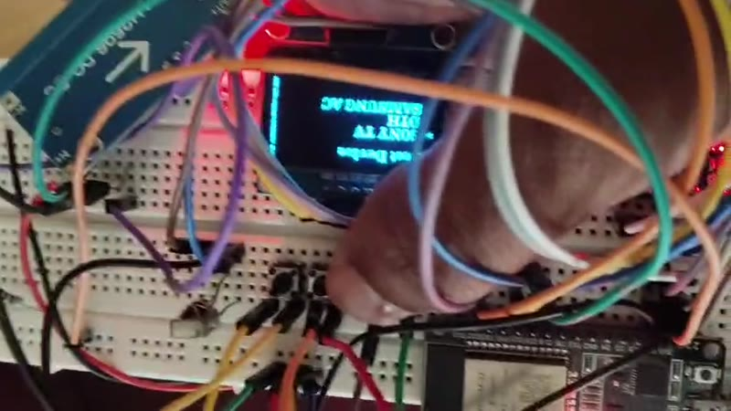
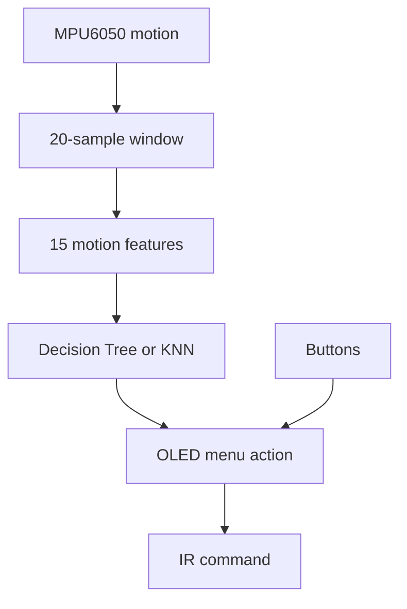
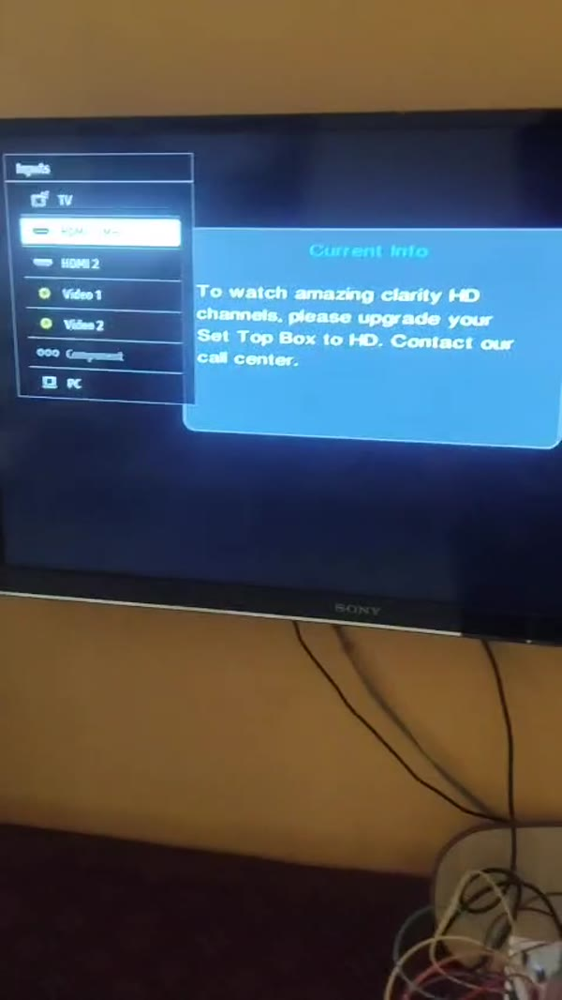

# ESP32 Gesture-Based Universal Smart Remote

An ESP32-based remote that combines an OLED device menu, infrared transmission, physical-button fallback, and an MPU6050 gesture interface. It supports Sony TV, RC6-based DTH commands, and Samsung AC state control through the `IRremoteESP8266` library.



## What the project demonstrates

- One handheld controller for multiple infrared appliances
- OLED menu for selecting a device and command
- Sony TV command transmission demonstrated on hardware
- Samsung AC state-based commands for power, temperature, mode, and fan
- Four menu gestures: `UP`, `DOWN`, `LEFT`, and `RIGHT`
- Reproducible MPU6050 data collection at 50 ms intervals
- Colab training and embedded export for Decision Tree and KNN models
- Physical buttons retained as a reliable fallback

## System flow



## Gesture controls

| Gesture | Menu action |
|---|---|
| `UP` | Move to the previous device or command |
| `DOWN` | Move to the next device or command |
| `LEFT` | Return to the main device menu |
| `RIGHT` | Enter the selected device or transmit the highlighted command |

## Hardware

- ESP32 WROOM-32 development board
- MPU6050 accelerometer/gyroscope
- SSD1306 128x64 OLED display
- IR LED/transmitter with a driver stage
- IR receiver module used during remote-code capture
- Three push buttons
- Regulated power supply/buck converter

See [the wiring table](docs/wiring.md) for the pin connections used by the firmware.

## Repository structure

```text
firmware/
  data_collector/       MPU6050 CSV data collection sketch
  gesture_remote/       Combined gesture, menu, and IR firmware
notebooks/
  train_gesture_models.ipynb
data/
  gesture_data_template.csv
docs/
  wiring.md
media/
  demonstration videos and preview images
```

The original report and presentation are retained at the repository root as project documentation.

## Software requirements

- Arduino IDE with ESP32 board support
- [U8g2](https://github.com/olikraus/u8g2)
- [IRremoteESP8266](https://github.com/crankyoldgit/IRremoteESP8266)
- Google Colab with `pandas`, `numpy`, `scikit-learn`, and `matplotlib`

`Wire` is included with the ESP32 Arduino core.

## Train the gesture model

### 1. Collect motion data

Upload [`data_collector.ino`](firmware/data_collector/data_collector.ino) to the ESP32. Open Serial Monitor at 115200 baud and send:

- `u` before performing an UP gesture
- `d` before performing a DOWN gesture
- `l` before performing a LEFT gesture
- `r` before performing a RIGHT gesture

Each command records 20 accelerometer samples over approximately one second. Collect at least 20-30 captures per gesture using the final physical sensor orientation.

### 2. Train in Google Colab

1. Save the serial output as `gesture_data.csv`.
2. Open [`train_gesture_models.ipynb`](notebooks/train_gesture_models.ipynb) in Colab.
3. Upload the CSV when requested and run every cell.
4. Compare test accuracy, cross-validation results, and confusion matrices.
5. Download the generated `gesture_model.h`.

### 3. Deploy to ESP32

Replace the placeholder [`gesture_model.h`](firmware/gesture_remote/gesture_model.h) with the file generated by Colab. Open [`gesture_remote.ino`](firmware/gesture_remote/gesture_remote.ino), select the ESP32 board, compile, and upload.

The firmware uses Decision Tree by default because it normally requires less embedded storage than KNN. Set `USE_KNN_MODEL` to `1` to test the exported KNN model.

Until a trained header is installed, the firmware clearly reports that it is using basic tilt fallback logic. This keeps the hardware usable without presenting untrained coefficients as an ML result.

## Demonstration

| Hardware and OLED menu | Sony TV response |
|---|---|
| [](media/hardware-menu-demo.mp4) | [](media/sony-tv-demo.mp4) |

Click either image to open the corresponding compressed demonstration video.

## Verification notes

- The supplied demonstration videos show the physical menu/IR prototype and a Sony TV responding to commands.
- IR values in the firmware are preserved from the supplied prototype. Codes may differ across appliance models and should be re-captured when changing hardware.
- The repository does not publish a fabricated dataset, trained header, or accuracy value. Model results must come from the user's collected motion data and the included notebook.

## Future improvements

- Store learned IR codes in non-volatile memory
- Add a guided on-device gesture calibration mode
- Replace delay-based IR feedback with a fully non-blocking state machine
- Design a compact PCB and enclosure
